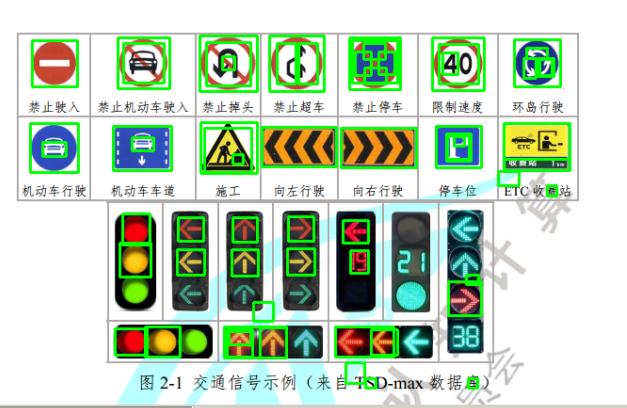

# Using OpneCV to detect traffic sign (without class)

## 1. methods

## 2. how to run 

```python
python main.py  # Get a ROI(region of interest)  for a picture
```

## 3. results 

<p align="center">
  
</p>

There are 64 objects in this image:
```python
rectangleList =  [[124, 351, 34, 28], [358, 349, 62, 32], [240, 349, 66, 33], [245, 354, 23, 14], [478, 301, 35, 36], [374, 268, 19, 24], [366, 236, 27, 24], [249, 233, 26, 26], [191, 233, 27, 25], [308, 232, 27, 26], [132, 229, 29, 33], [238, 62, 13, 14], [468, 49, 42, 42], [389, 74, 23, 17], [404, 57, 17, 24], [379, 57, 17, 25], [388, 48, 23, 17], [133, 48, 43, 42], [319, 48, 20, 43], [296, 48, 20, 43], [221, 47, 47, 46], [497, 294, 13, 10], [476, 144, 26, 29], [142, 148, 23, 14], [47, 153, 25, 15], [574, 64, 16, 19], [558, 64, 13, 21], [561, 53, 22, 11], array([376,  45,  48,  45]), [396, 352, 28, 27], [243, 352, 27, 29], [278, 350, 28, 32], [156, 349, 37, 32], [248, 267, 28, 28], [190, 267, 29, 27], [307, 266, 29, 28], [129, 260, 33, 36], [364, 138, 80, 42], [219, 138, 50, 47], [249, 166, 11, 10], [280, 137, 79, 42], [537, 133, 70, 38], array([477, 146,  23,  25]), array([484, 147,  11,  10]), array([575,  65,  13,  17]), array([472,  58,  16,  23]), array([499, 404,  10,  10]), array([390, 404,  11,  10]), array([369, 387,  20,  22]), array([271, 323,  21,  20]), array([583, 199,  10,  11]), array([531, 184,  22,  15]), array([465, 136,  48,  44]), array([122, 136,  62,  47]), array([537, 133,  70,  50]), array([ 34, 133,  51,  52]), array([215, 132,  60,  54]), array([36, 45, 48, 49]), array([548,  44,  49,  50]), array([461,  42,  55,  56]), array([373,  42,  54,  55]), array([127,  42,  55,  54]), array([288,  40,  58,  59]), array([214,  40,  61,  59])]
```


